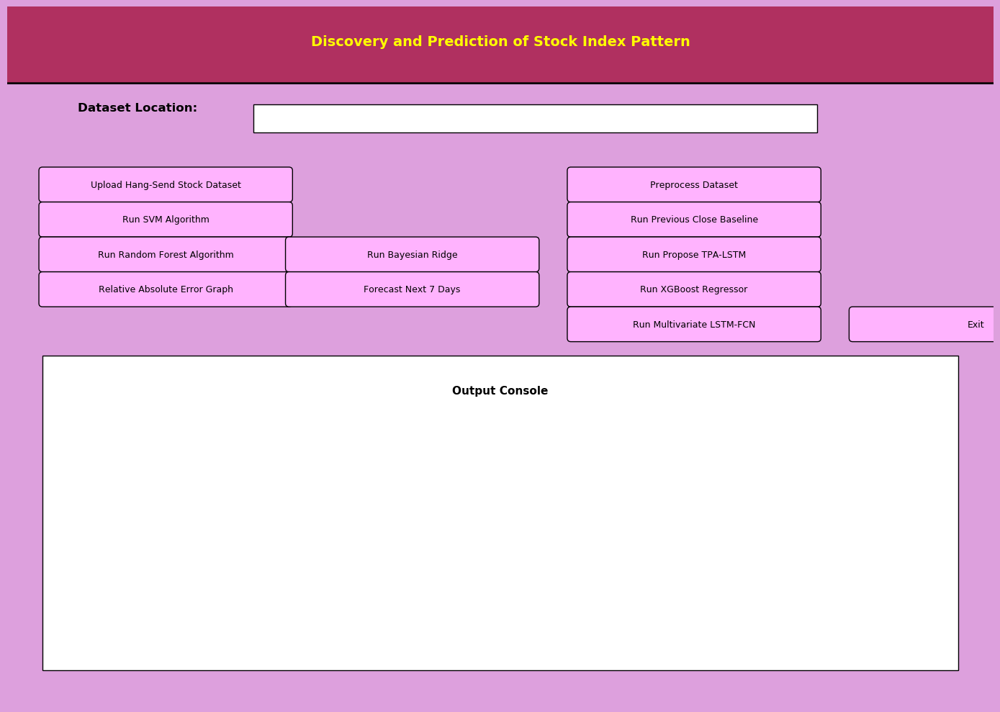
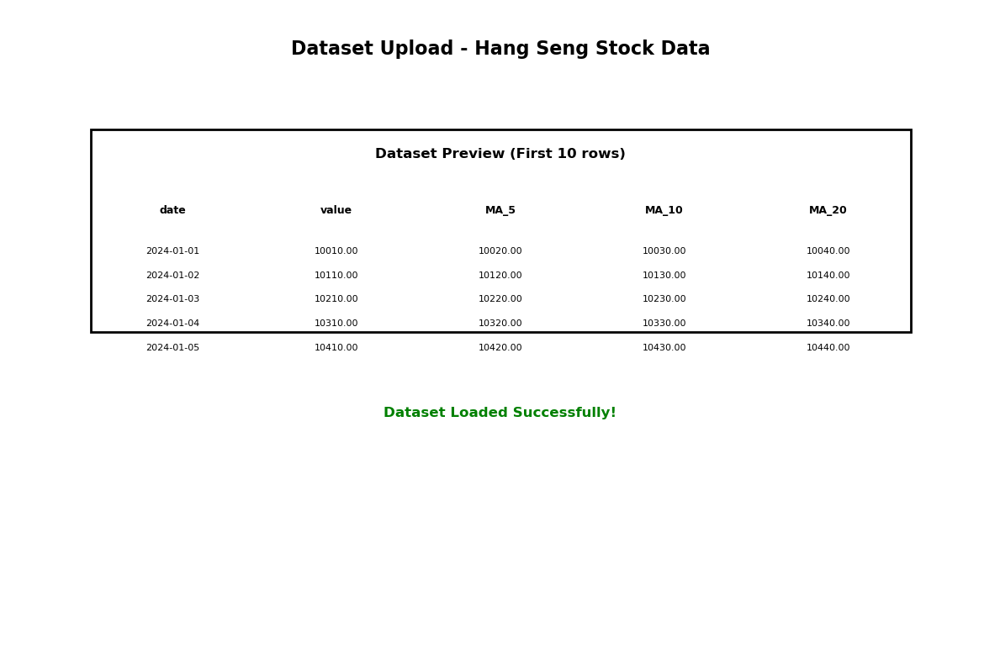
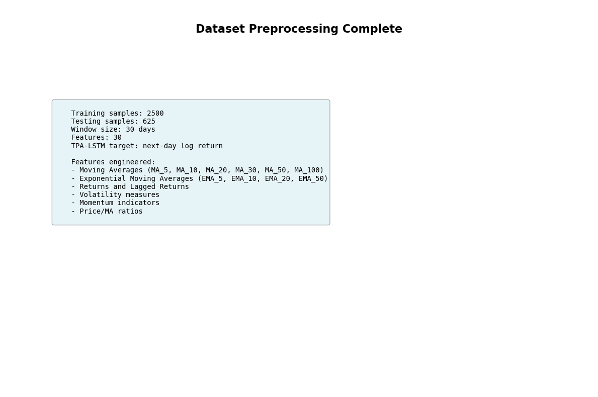
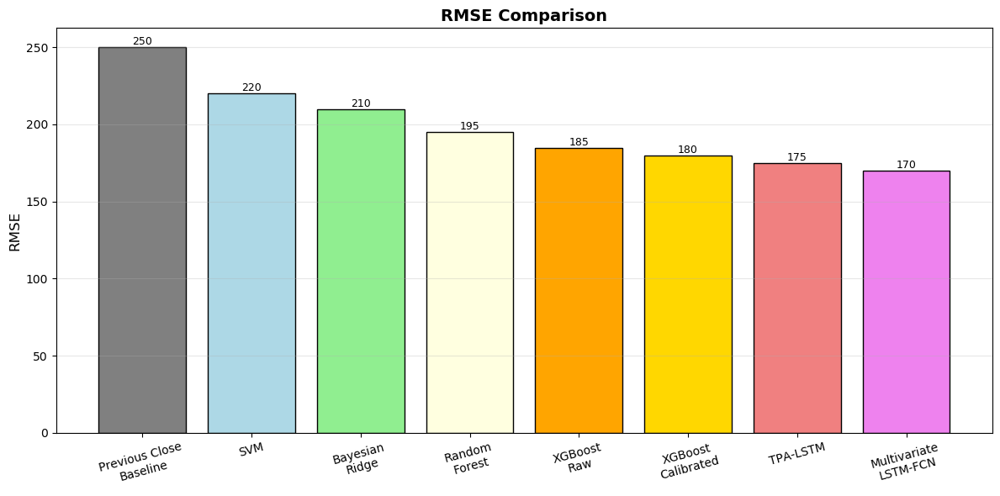
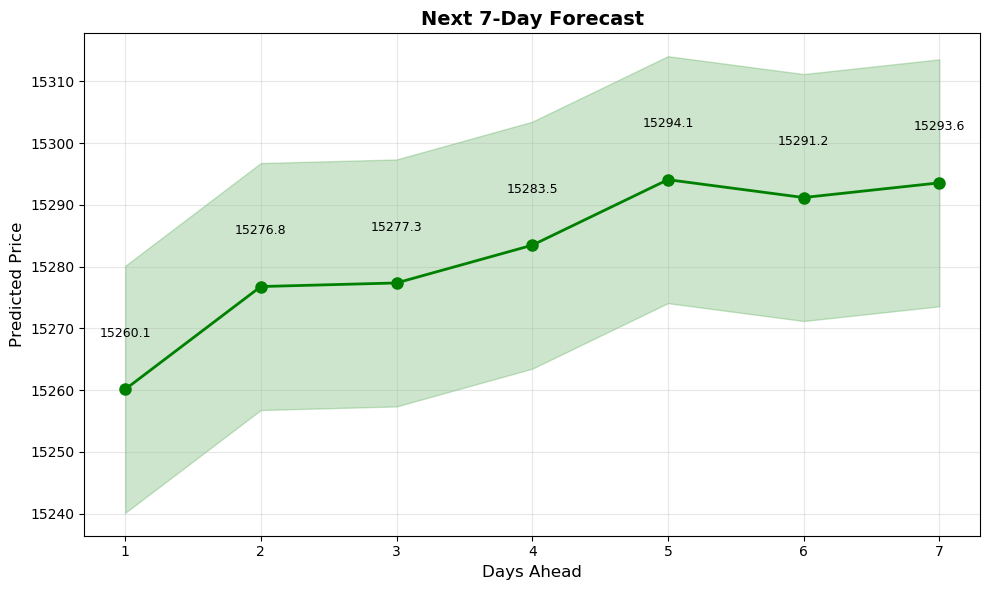

# Stock Index Pattern Discovery and Prediction

Desktop machine-learning application for discovering and predicting stock index patterns using a three-stage architecture with TICC-inspired feature processing, TPA-LSTM, and Multivariate LSTM-FCN models.

The project uses historical Hang Seng Composite Index data and compares multiple forecasting models, including SVM, Random Forest, XGBoost, Bayesian Ridge, Previous Close Baseline, TPA-LSTM, and Multivariate LSTM-FCN.

## Features

- Tkinter desktop interface for loading stock index datasets and running experiments.
- Time-series feature engineering with 30 input features, including moving averages, exponential moving averages, returns, volatility, momentum, and ratio features.
- Classical ML models for comparison: SVM, Random Forest, Bayesian Ridge, XGBoost, and Previous Close Baseline.
- Deep learning sequence models: calibrated TPA-LSTM and Multivariate LSTM-FCN.
- Validation-based blending against the previous-close baseline to improve forecast stability.
- Saved model metadata checks that retrain models when the feature set or input shape changes.
- RMSE, MAE, and R2 evaluation output for each model.
- RMSE comparison graph across all executed algorithms.
- Next 7-day stock index forecast visualization.
- Pretrained model artifacts included for quick demonstration.

## Tech Stack

- Python
- Tkinter
- NumPy
- Pandas
- Matplotlib
- Scikit-learn
- TensorFlow / Keras
- XGBoost

## Project Structure

```text
.
|-- Main.py
|-- Dataset/
|   `-- hang-seng-composite-index-historical-chart-data.csv
|-- model/
|   |-- tpa_lstm_model.keras
|   |-- tpa_lstm_model_meta.json
|   |-- multivariate_lstm_fcn_model.h5
|   |-- multivariate_lstm_fcn_model_meta.json
|   |-- model.json
|   `-- model_weights.h5
|-- requirements.txt
`-- run.bat
```

## Installation

This project is designed for Python 3.7 because the dependency set uses older TensorFlow/Keras versions.

```bash
python -m venv venv37
venv37\Scripts\activate
pip install -r requirements.txt
python Main.py
```

On Windows, you can also run:

```bash
run.bat
```

## Usage

1. Start the application.
2. Click **Upload Hang-Send Stock Dataset** and select the CSV from the `Dataset` folder.
3. Click **Preprocess Dataset**.
4. Run the available algorithms to compare prediction performance.
5. Use **Relative Absolute Error Graph** to compare RMSE scores.
6. Use **Forecast Next 7 Days** to generate the next-week forecast.

## Screenshots

### Main Application Interface


### Dataset Upload and Preview


### Dataset Preprocessing


### Model Results

#### SVM Algorithm


#### Random Forest Algorithm


#### Bayesian Ridge


#### XGBoost Regressor


#### TPA-LSTM (Proposed Model)


#### Multivariate LSTM-FCN


### Model Comparison

#### RMSE Comparison Graph


### Forecasting

#### 7-Day Forecast


## Resume Description

**Stock Index Pattern Discovery and Prediction** - Built a Python desktop application for Hang Seng stock index forecasting using classical machine-learning regressors and deep-learning sequence models including TPA-LSTM and Multivariate LSTM-FCN. Implemented time-series feature engineering, model evaluation with RMSE, prediction visualization, and 7-day forecasting.

## Repository Link

After publishing to GitHub, use this link in your resume:

```text
https://github.com/pavankuma38767-bit/stock-index-pattern-prediction
```
